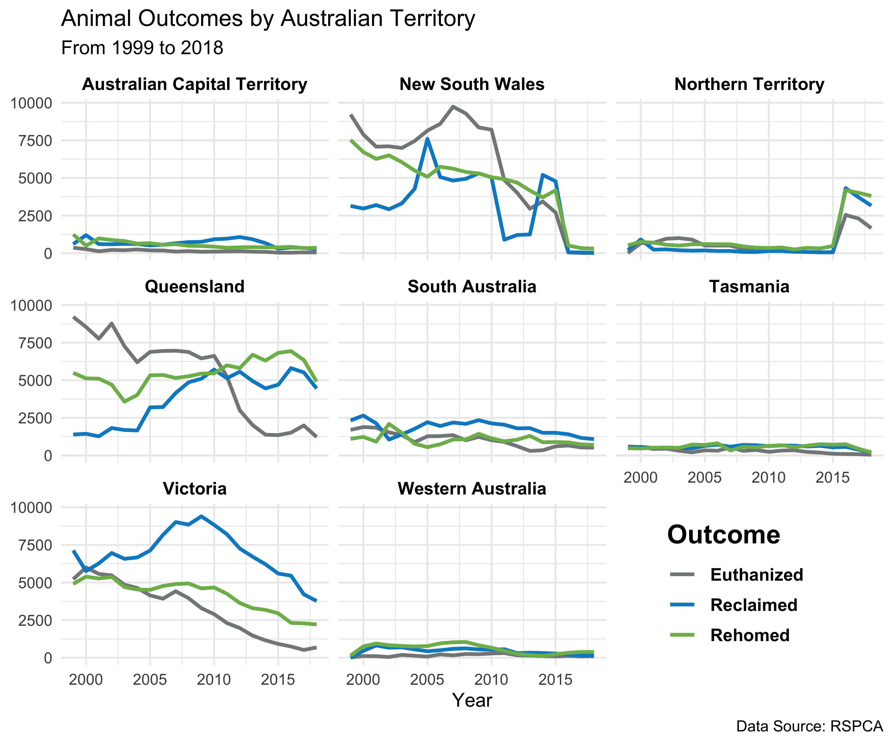
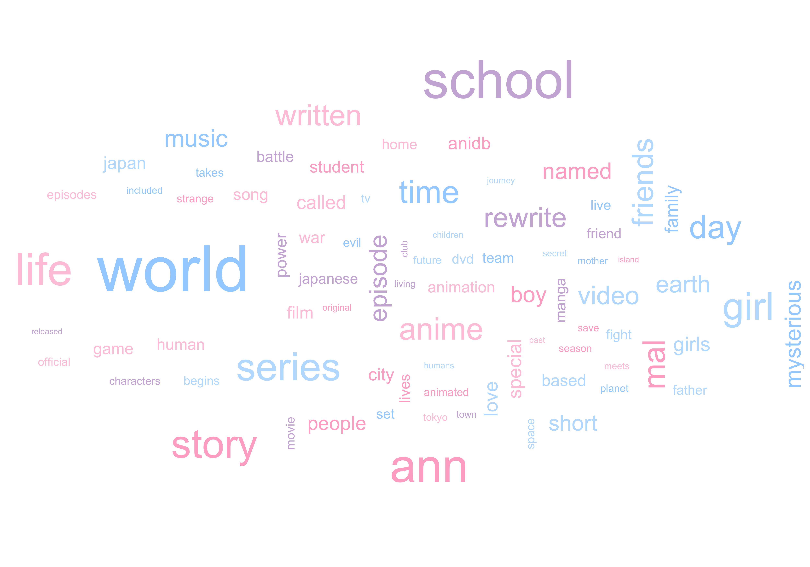
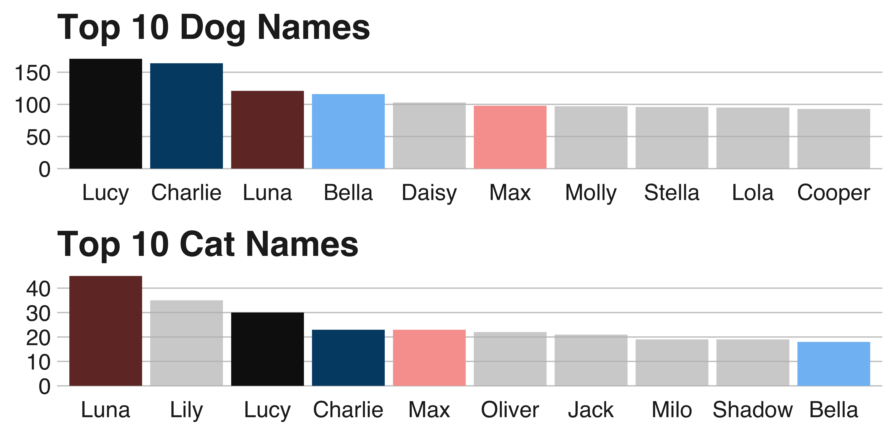

# Mandy's `TidyTuesday` attempts

Here I will attempt to do the weekly [TidyTuesday challenge](https://github.com/rfordatascience/tidytuesday) from `rfordatascience`.

I will use these challenges to improve my data visualisation skills in R, get more practice using Python and potentially to learn D3.

📁 - folder containing all files from a week

📊 - any plots created that week

📃 - analysis script/notebook for that week 

# 2021

## Week 10

### Super Bowl Commercials ([📁](2021_wk10) / [📊](2021_wk10/plots/) / [📃](2021_wk10/superbowl_ads.Rmd))

# 2020

## Week 30

### RSPCA Animal Outcomes ([📁](2020_wk30) / [📊](2020_wk30/plots/) / [📃](2020_wk30/rspca_analysis.Rmd))

## Week 28

### Coffee Ratings ([📁](2020_wk28) / [📊](2020_wk28/plots/) / [📃](2020_wk28/coffee_analysis.Rmd))

# 2019

## Week 17

### Anime Data ([📁](2019_wk17) / [📊](2019_wk17/plots/) / [📃](2019_wk17/anime_fun.Rmd))

## Week 13

### Seattle Pet Names ([📁](2019_wk13) / [📊](2019_wk13/plots/) / [📃](2019_wk13/seattle_pets.Rmd))

